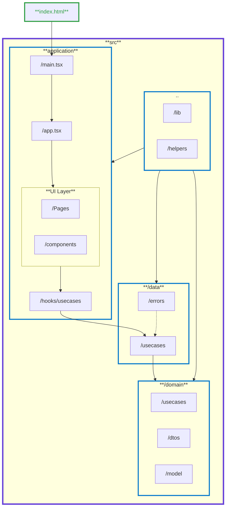

```mermaid

flowchart TD
 A["**index.html**"]

 subgraph B["**application**"]
      B1["/main.tsx"]
      B2["/app.tsx"]
      subgraph U["**UI Layer**"]
        U1["/Pages"]
        U2["/components"]
      end
      B4["/hooks/usecases"]
  end

 subgraph C["**/data**"]
        C1["/errors"]
        C2["/usecases"]
  end

 subgraph D["**/domain**"]
        D1["/usecases"]
        D2["/dtos"]
        D3["/model"]
  end

 subgraph L[".."]
        L1["/lib"]
        L3["/helpers"]
  end

 subgraph s2["**src**"]
        B
        C
        D
        L
  end


    %% Application flow
    A --> B1
    B1 --> B2
    B2 --> U
    U --> B4
    B4 --> C2
    C1 -.-> C2
    C2 --> D
    L --> D
    L --> C
    L --> B
    

    %% Styling

      %% Styling: border colors
      style A stroke:#2f9e44,stroke-width:3px,color:#2f9e44
      style B stroke:#0077cc,stroke-width:3px
      style C stroke:#0077cc,stroke-width:3px
      style D stroke:#0077cc,stroke-width:3px
      style L stroke:#0077cc,stroke-width:3px
      style s2 stroke:#6741d9,stroke-width:4px

```
